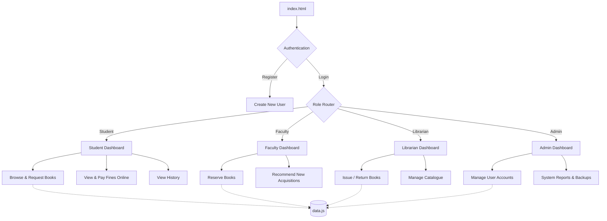

# VEMU Library Management System

A robust, modern, component-based Single Page Application (SPA) designed to manage the comprehensive operations of a digital library. The system features a responsive front-end architecture and handles interactions for multiple user types including Students, Faculty, Librarians, and Administrators.

## 🌟 Key Features

* **Comprehensive Role-Based Access**: Specialized dashboards providing targeted capabilities for Admins, Librarians, Faculty, and Students.
* **Online Fine Payments & Verification**: Students can view outstanding dues, scan a mock UPI QR code, and submit their UTR. Librarians/Admins can instantly verify the payment and automatically clear overdue book records.
* **Dynamic Multi-Profile Registration**: Intelligent registration flow that adapts based on user role—capturing explicit ID Numbers for staff versus Roll Numbers, Degrees, Departments, and Pursuing Year for students.
* **Smart Search & Catalogue Management**: Real-time catalogue filtering by title, author, subject, or ISBN alongside comprehensive inventory oversight.
* **Advanced Tracking & Alerts**: Automated overdue fine calculation (₹5/day) paired with easy-to-read metric dashboards and status alerts.
* **Detailed Reporting & Analytics**: Track library performance, fine collection (online vs desk), current loans, and user metrics with one-click export capability.

## 📋 System Requirements

### 1. General Requirements
* The system shall allow users to login using a unique username and password.
* The system shall provide dynamic role-based registration capturing specific academic profiles (ID Numbers for staff, Roll Numbers, Degrees, Departments, and Pursuing Years for students).
* The system shall provide role-based access for Admin, Librarian, Faculty, and Students.
* The system shall maintain accurate and up-to-date library records.
* The system shall be available through a web-based interface.

### 2. Admin User Requirements
* Admin shall be able to create, update, and delete user accounts with full academic details.
* Admin shall be able to assign roles to users.
* Admin shall be able to view all library records.
* Admin shall be able to generate overall reports (users, books, transactions, and collected fines).
* Admin shall be able to verify online fine payments and automatically clear student dues.
* Admin shall be able to backup and restore database.

### 3. Librarian User Requirements
* Librarian shall be able to add new books to the library.
* Librarian shall be able to update book details (title, author, edition, subject).
* Librarian shall be able to delete books that are lost or damaged.
* Librarian shall be able to issue books to students and faculty.
* Librarian shall be able to accept returned books.
* Librarian shall be able to calculate fines for late returns.
* Librarian shall be able to verify online fine payments submitted by students and clear their dues.
* Librarian shall be able to check book availability.
* Librarian shall be able to generate issue/return reports.

### 4. Student User Requirements
* Student shall be able to login using student credentials.
* Student shall be able to search books by title, author, subject, or ISBN.
* Student shall be able to view book availability status.
* Student shall be able to request book issue.
* Student shall be able to view issued books and due dates.
* Student shall receive notifications for due dates and fines.
* Student shall be able to pay overdue fines online via a mock UPI QR code and submit their transaction UTR for verification.

### 5. Faculty User Requirements
* Faculty shall be able to login using faculty credentials.
* Faculty shall be able to search and reserve books.
* Faculty shall be able to borrow books for longer duration.
* Faculty shall be able to recommend new books to the librarian.
* Faculty shall be able to view borrowing history.

### 6. Non-Functional User Requirements
* The system shall be easy to use and require minimal training.
* The system shall ensure data security and privacy.
* The system shall respond to user requests within acceptable time limits.
* The system shall support multiple users simultaneously.
* The system shall be scalable to add more books and users.

### 7. User Interface Requirements
* Simple login screen for all users.
* Dashboard for Admin and Librarian.
* Search and filter options for books.
* Clear display of issue/return status.
* Alert messages for due dates and fines.

## 🏗️ Project Architecture

The project adheres to professional web development standards, applying the Separation of Concerns (SoC) principle by splitting the codebase into modular, domain-specific files.

```text
Project-LBM/
├── index.html                 # Application Entry Point
└── assets/
    ├── css/                   # Cascading Style Sheets
    │   ├── base.css           (Variables, resets, layouts, animations)
    │   ├── components.css     (Navigation bars, buttons, generic components)
    │   └── pages.css          (Feature pages, hero sections, dashboard designs)
    └── js/                    # JavaScript Logic
        ├── data.js            (Mock Library Database: books, users, transactions)
        ├── utils.js           (Utility operations: date parsing, DOM helpers)
        ├── auth.js            (Registration, Login, and state management)
        ├── main.js            (Application routing & initialization)
        ├── admin.js           (Admin dashboard functions)
        ├── librarian.js       (Librarian dashboard functions)
        ├── faculty.js         (Faculty dashboard functions)
        └── student.js         (Student dashboard functions)
```

## 🔄 Structured Flow Diagram



## 🛠️ Technologies Used

### 🌐 HTML Technology
* **Basic Document Structure**: Using fundamental tags like `<html>`, `<head>`, `<title>`, and `<body>`.
* **Text Formatting**: Structuring content with headings (`<h1>` - `<h6>`), paragraphs (`<p>`), and inline elements (`<span>`, `<strong>`, `<em>`).
* **Links & Media**: Inserting hyperlinks (`<a>`) and basic image structures (``).
* **Lists & Tables**: Displaying data using unordered lists (`<ul>`, `<li>`) and organizing structured data with HTML tables (`<table>`, `<thead>`, `<tr>`, `<th>`, `<td>`).
* **Base Forms**: Building user input sections using standard `<input>`, `<select>`, `<option>`, and `<button>` elements for the registration and login flows.
* **Divisions**: Creating logical grouping using the generic `<div>` tag for layout sections.

### 🎨 CSS Technology
* **Basic Selectors**: Targeting HTML elements for styling using tag names, IDs (`#`), and classes (`.`).
* **The Box Model**: Controlling layout dimensions and spacing using `width`, `height`, `margin`, `padding`, and `border` properties.
* **Colors & Typography**: Customizing the visual interface with `color`, `background-color`, `font-family`, `font-size`, `font-weight`, and `text-align`.
* **Display & Positioning**: Arranging page elements utilizing `display: block`, `inline-block`, and `none`, along with standard `position: absolute`, `relative`, and `fixed`.
* **Basic Interactivity**: Adding simple visual feedback for users using the standard `:hover` pseudo-class on buttons and navigation links.

### ⚡ JavaScript Technology
* **Variables & Data Types**: Storing information using standard variables (`var`), including strings, numbers, arrays, and objects (like the books and users data).
* **Functions**: Creating reusable blocks of code (e.g., `doLogin()`, `showSec()`) to execute specific tasks when called.
* **Control Structures**: Making logical decisions using standard `if...else` statements and iterating over data arrays.
* **DOM Manipulation**: Interacting with the HTML document by selecting elements (`document.getElementById()`), changing content (`innerHTML`), and modifying CSS styles dynamically (`element.style.display`).
* **Event Handling**: Triggering JavaScript functions from HTML elements using intrinsic event handlers like `onclick`, `oninput`, and `onchange`.
* **Basic Arithmetic**: Performing standard mathematical operations (addition, subtraction, multiplication) to calculate library late fines and track book quantities.
